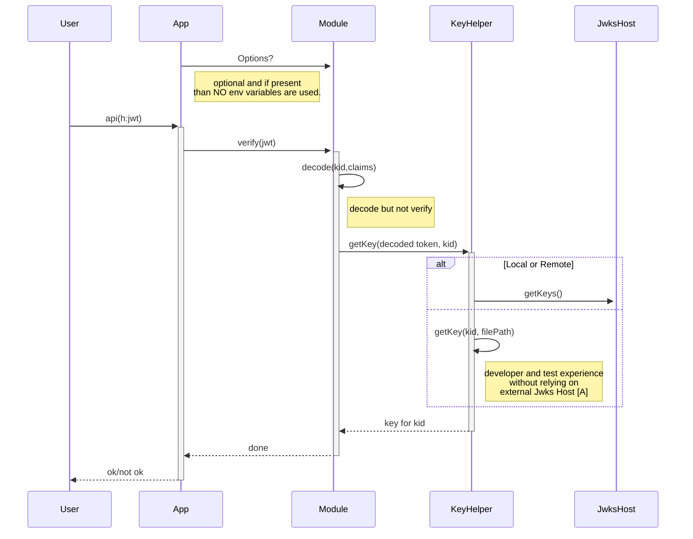
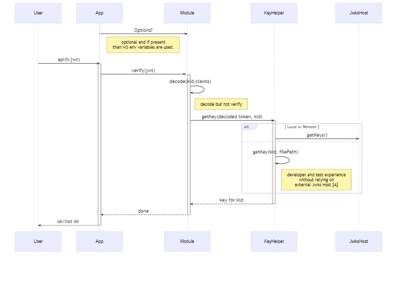

|Build and NPM package status | |
|-|-|
|[](https://www.npmjs.com/package/jwtproxy)|[](https://github.com/cicorias/jwtproxy/actions?query=workflow%3A%22Node.js+CI%22)|

# Description
**jwtproxy** provides a simple middleware component with a few switches that allow verification of [`JWT`](https://en.wikipedia.org/wiki/JSON_Web_Token) using either symmetric / shared keys or RSA keys. Relying upon two other libraries - [`jsonwebtoken`](https://www.npmjs.com/package/jsonwebtoken) and [`jwks-rsa`](https://www.npmjs.com/package/jwks-rsa) it further simplifies and extends the configration of the needs.

# Overview - jwtproxy
Often there is a need for a simple [`JWT`](https://en.wikipedia.org/wiki/JSON_Web_Token) validation or verification within a [Node.js](https://nodejs.org/en/), or [Express.js](https://expressjs.com/) application. While there are options such as reverse proxies like:
- [Envoy](https://www.envoyproxy.io/),
- [nginx](https://www.nginx.com/),
- [Istio](https://istio.io/)

The initial need was to simplify a needed deployment for basic `JWT` validation and not initially overcomplicate a Kubernetes deployment with added side-car containers, ingress containers, etc. While some Cloud providers have some of these capabilities ready to go, this component simplifies the initial need and allows evolution of the concern before biting off on something much more significant.

It can also be enabled or disabled via a configuration or environment feature switch.

The initial goals were:

1. must be an Express middleware component that provides a simple way to include or excluded within the pipeline
2. further simplifiy and externalize settings as needed leaning on `dotenv` and `.env` files for local, and environment variables for runtime
3. while injected into the pipeline should be easy to disable, modify, etc.

> **Note: more details are in [Overview](./docs/Overview.md).**

# Setup and installation
There is an example ExpressJS application in the `./example` folder. Written in TypeScript (both the component and sample Express Js App) it is fully transpiled to JavaScript.

## Adding to Express
Like any middleware for ExpressJS, this should be inserted early on in the pipeline. Since it reads the raw NodeJS HTTP Headers it can be before other middleware that parses cookies, the body, etc.

In the following, we allow two algorithms, and exclude two paths from checking if the `JWT` is in the `Authorization` header. And, while we do state `RS256`, we actually only use `HS256` as that is the symmetric algoritm used. We are not setting up a `Jwks URL` for retreival of keys.


### Example setup
```javascript

import jwtProxy, { JwtProxyOptions } from 'jwtproxy'

const sharedSecret = 'notagreatsecret'

const options: JwtProxyOptions = {
  algorithms: [ 'RS256','HS256'],
  excluded: ['/status', '/sign'],
  secretOrKey: sharedSecret
}

const proxy = jwtProxy(options),
this.app.use(proxy)

```

## Quick start with sample

>NOTE: Make sure you have **NodeJs 10x** or better and **npm version 5.4** or greater.

Navigate to `./example` folder and execute the following:

```bash
# the ci command uses the package-lock.json or shrinkwrap to do a deterministic install
npm ci 
npm run build
npm start
```
At this point you should see something similar:

```
$ npm run fresh

> example@1.0.0 fresh E:\g\npm-projs\jwtproxy\example
> npx npm-run-all ci build start

npx: installed 58 in 6.288s

> example@1.0.0 ci E:\g\npm-projs\jwtproxy\example
> npm ci

npm WARN prepare removing existing node_modules/ before installation
added 60 packages in 2.925s

> example@1.0.0 build E:\g\npm-projs\jwtproxy\example
> tsc --build .


> example@1.0.0 start E:\g\npm-projs\jwtproxy\example
> node server.js

App listening on the http://localhost:5000


```

### one line startup

The `package.json` has a simple `npm script` that combines all three -- just run the following as an alternative if you want to save a few keystrokes.

```
npm run fresh
```

### Port in use

If you see something like the following, that means the port is already used by some other process.

```
> example@1.0.0 start E:\g\npm-projs\jwtproxy\example
> node server.js

events.js:183
      throw er; // Unhandled 'error' event
      ^

Error: listen EADDRINUSE 127.0.0.1:5000
    at Server.setupListenHandle [as _listen2] (net.js:1360:14)   
    at listenInCluster (net.js:1401:12)
    at GetAddrInfoReqWrap.doListen [as callback] (net.js:1510:7) 
    at GetAddrInfoReqWrap.onlookup [as oncomplete] (dns.js:72:10)
npm ERR! code ELIFECYCLE
npm ERR! errno 1
npm ERR! example@1.0.0 start: `node server.js`
npm ERR! Exit status 1
npm ERR! 
npm ERR! Failed at the example@1.0.0 start script.
npm ERR! This is probably not a problem with npm. There is likely additional logging output above.
```

To address this set an environment variable either in a `.env` file like the following, or with your operating system shell method -- `export PORT=5500` or in PowerShell `$env:PORT=5500`. In bash/zsh you can also just pass this on the command line as `PORT=5500 npm start`

```bash
PORT=5500
HOST=localhost


```

## Either create or modifying existing Express JS application

### npm install `jwptproxy`

```bash
npm i jwtproxy
```

### modify your express app

Follow the instructions above in [Example setup](Example setup) for the modifications.


# Sequence Diagram Jwt Proxy






# Options object
An option object is optionaly injected at the start. The presence of the `options` object implies that **NO** environment variables are to be used. This permits couple of scenarios
- Explicit paths that need something different - so the injection can override what an `env` variable might provide. Regardless, even in that situation, the code that creates the `options` object can also pull from `env`.
- Developer and Test scenarios - Test frameworks need to create valid tokens, and the verification needs some key data offline and disconnected at least during unit testing. For develper experience, this allows ease of use whithout the need to standup a signing authority and Jwks Endpoint just to try out the module.


```javascript
/** Options for THIS middlware */
export interface JwtProxyOptions {
  disable?: boolean|undefined,
  secretOrKey?: string,
  audience?: string,
  issuer?: string,
  jwksUrl?: string,
  algorithms?: Algorithm[],
  excluded?: string[]
}

```


|option|purpose|example|
|-|-|-|
|disable|completely disable the middleware and do NO checks|`disable = true`|
|secretOrKey|either the shared key or if `jwksUrl` is populated, this can be blank|`secretOrKey='notagreatkey'`|
|audience|a list of audiences in one line separated by `;` - if ANY of the aud match, then the verify passes| `audience = 'shipping;receiving;marketing'`|
|issuer|for `jwks` RSA verification of the issuer on the `JWT`|`issuer = 'foo.bar.com'`|
|jwksUrl|the HTTP endpoint used for retrieval of keysets then used to match the key name present in the `JWT` see [jwks](https://auth0.com/docs/tokens/concepts/jwks)|`jwksUrl = 'https://YOUR_DOMAIN/.well-known/jwks.json'`|
|algorithms|any of the supported algorithms within `jsonwebtoken` see [Algorithms](https://www.npmjs.com/package/jsonwebtoken#algorithms-supported)| `algorithms = ['RS256', 'HS258']`|
|exluded|array of paths that are specifically exluded by exact match on `Request.URL` not including the query string|`exluded= ['/status', '/health', '/issue']`|


### Disable check
The following uses env or options and if EITHER are set to disable, the middleware is turned OFF.
```javascript
  const envDisabled: boolean = process.env.JWTP_DISABLE == null ? false : process.env.JWTP_DISABLE.toLowerCase() === 'true';
  const optDisabled = proxyOptions?.disable as boolean;
  if (optDisabled || envDisabled)
  {
    logger('jwt proxy disabled - no jwt verification will occure'); 
    return async (req:Request, res:Response, next:NextFunction): Promise<void> =>{
      next();
      return;
    }
  }


```

## Rule for Options
```javascript
  secretOrKey?: string,
  audience?: string, - 'if present also validate'
  issuer?: string, - 'if present also validate'
  jwksUrl?: string,
  algorithms?: Algorithm[], - 'if there is an alt alg to use for token verification - note that HS256 is default'
  excluded?: string[] - 'paths to exlude in routes'
```


```javascript
{ exclude?: ,
  alg?: ,
  jwksurl: 'this can be `string|function`,
  iss? : ,
  aud? : }

```

### alg
if `algorithms` is supplied, this becomes a verification aspect. Jwt tokens supply the `algorithms` as part of the header, along with the `kid`. We use the `algorithms` supplied to as the constrained set - if the `alg` on JWT token is not in the set it fails validation.

### jwksurl
if the `jwksurl` is a string, it is parsed to ensure its valid url. If so, then the `JwksHost` is to be called for the keyset and key for `kid`.

if `jwksurl` is a string and not a url, it is assumed to be the verification key - in `RS256` this is the public key material in PEM format.

If the `jwksurl` is a function then it implements a known interface (TBD) that provides a callback that delivers the secret or key for the `kid`

> Notes: from the diagram

- [A] Key information provided as part of the `options` object or an `environment` variable can be full `URL` or file reference to local `PEM` file that contains the `public key` to verify the singature.

## Environment Variables.
The presence of an `options` object precludes any `env` variables to be used for processing. If the `options` object is absent or empty, the `env` variables are used for configuration.

>Note: all of the `jwtproxy` variables are prefixed with `JWTP_`

- JWTP_ALG: string
- JWTP_URL: string
- JWTP_ISS: string
- JWTP_AUD: string = 'myaudience'
- JWTP_EXCLUDE: string = /path1,path2/  -- 

It is NOT expected in the `env` use case that the `JWTP_URL` will be used as a `function` type. Either a pure `PEM` public key for signature verification or a proper `URL` to a Jwks Host endpoint that provide key material.


