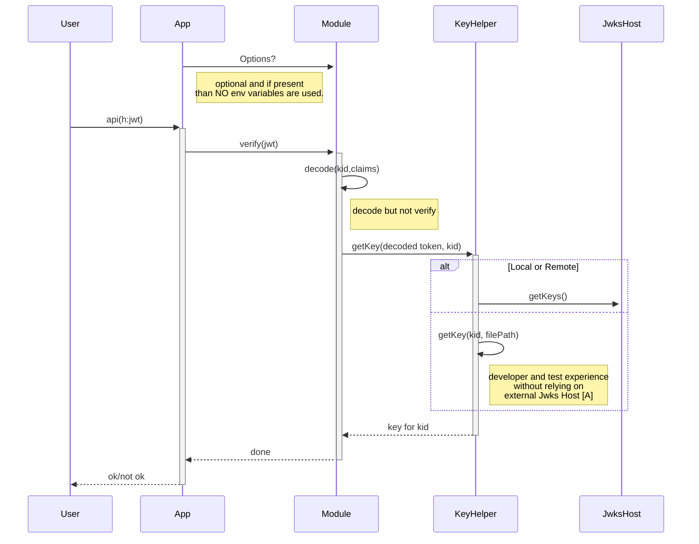
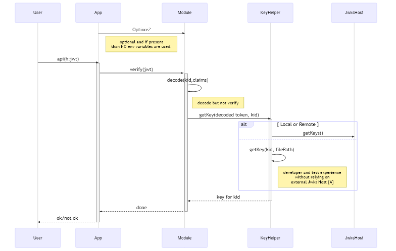

# Sequence Diagram Jwt Proxy






# Options object
An option object is optionaly injected at the start. The presence of the `options` object implies that **NO** environment variables are to be used. This permits couple of scenarios
- Explicit paths that need something different - so the injection can override what an `env` variable might provide. Regardless, even in that situation, the code that creates the `options` object can also pull from `env`.
- Developer and Test scenarios - Test frameworks need to create valid tokens, and the verification needs some key data offline and disconnected at least during unit testing. For develper experience, this allows ease of use whithout the need to standup a signing authority and Jwks Endpoint just to try out the module.

## Rule for Options
```
  secretOrKey?: string,
  audience?: string, - 'if present also validate'
  issuer?: string, - 'if present also validate'
  jwksUrl?: string,
  algorithms?: Algorithm[], - 'if there is an alt alg to use for token verification - note that HS256 is default'
  excluded?: string[] - 'paths to exlude in routes'
```


```
{ exclude?: ,
  alg?: ,
  jwksurl: 'this can be `string|function`,
  iss? : ,
  aud? : }

```

### alg
if `algorithms` is supplied, this becomes a verification aspect. Jwt tokens supply the `algorithms` as part of the header, along with the `kid`. We use the `algorithms` supplied to as the constrained set - if the `alg` on JWT token is not in the set it fails validation.

### jwksurl
if the `jwksurl` is a string, it is parsed to ensure its valid url. If so, then the `JwksHost` is to be called for the keyset and key for `kid`.

if `jwksurl` is a string and not a url, it is assumed to be the verification key - in `RS256` this is the public key material in PEM format.

If the `jwksurl` is a function then it implements a known interface (TBD) that provides a callback that delivers the secret or key for the `kid`

> Notes: from the diagram

- [A] Key information provided as part of the `options` object or an `environment` variable can be full `URL` or file reference to local `PEM` file that contains the `public key` to verify the singature.

## Environment Variables.
The presence of an `options` object precludes any `env` variables to be used for processing. If the `options` object is absent or empty, the `env` variables are used for configuration.

>Note: all of the `jwtproxy` variables are prefixed with `JWTP_`

- JWTP_ALG: string
- JWTP_URL: string
- JWTP_ISS: string
- JWTP_AUD: string = 'myaudience'

It is NOT expected in the `env` use case that the `JWTP_URL` will be used as a `function` type. Either a pure `PEM` public key for signature verification or a proper `URL` to a Jwks Host endpoint that provide key material.

